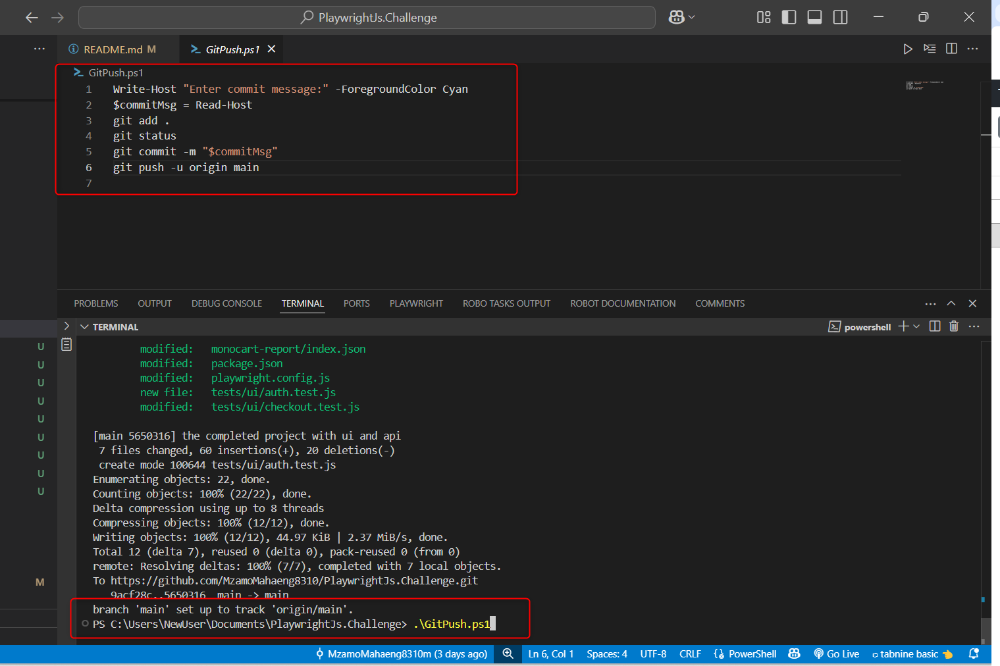

# PlaywrightJs.Challenge
Playwright Setup
Prerequisites 
Node.js version 16 or higher and a code editor like VS Code, along with a basic understanding of JavaScript or TypeScript. You will need the node package manager. Please verify the versions this way

 
With you VScode open and  in the terminal window. Issue the command 
npm init playwright@latest.
In the terminal , plase follow the promps as seen below in the screenshot.
Javascript
Tests
True 
true
 
You setup will be complete. 

Execution: 
Once the setup is complete and the git repository has been pulled from the repository. The best way to run all the tests is using the command ‘npx playwright test’. This will run all the test that reside in the test folder. 

Best Way For Execution
However this automation project , I have made it easy for execution and we don’t even need to clone and install playwright. You can simply use GitActions.   to execution the automation from the pipeline. Here is how to do it:
From the Git repository click on Action

 
Then from the Action page you will see All Workflows.Now click on 
Playwright Tests on the top left hand side

 
now the view you will is the the playwright.yaml file. I added a workflow dispatch which will allow you to run the pipeline for the main branch.

so select run workflow
and run workflow

wait for the GitAction to complete and you will see in all green upon completion.
Then you select the completed pipeline exetion.This will generate a new artefact which will then contain the monocart report.

This is a what the monocart report looks like. I'm viewing the html.
This is the monocart report that I donloaded from the GitActions execution

Another Tip. I created a powershell script to automate the commit process.

Thank you!!!!!!!! Nnare Mahaeng Im the best
